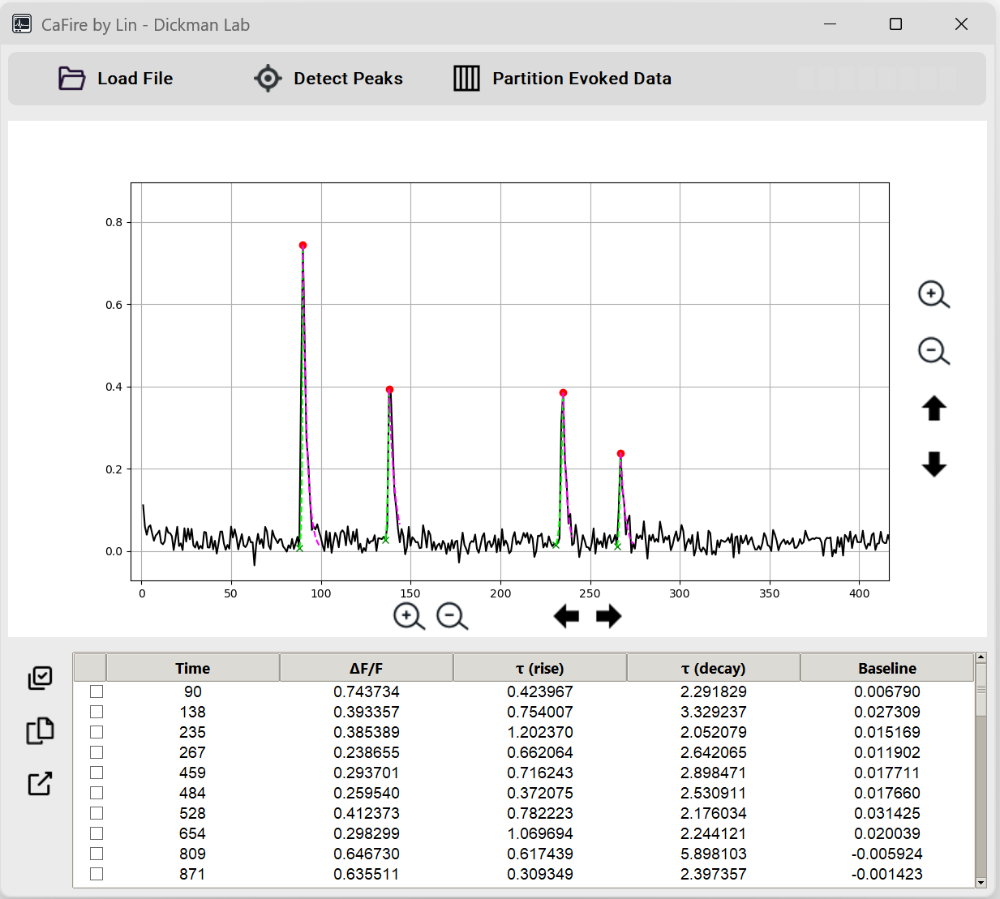
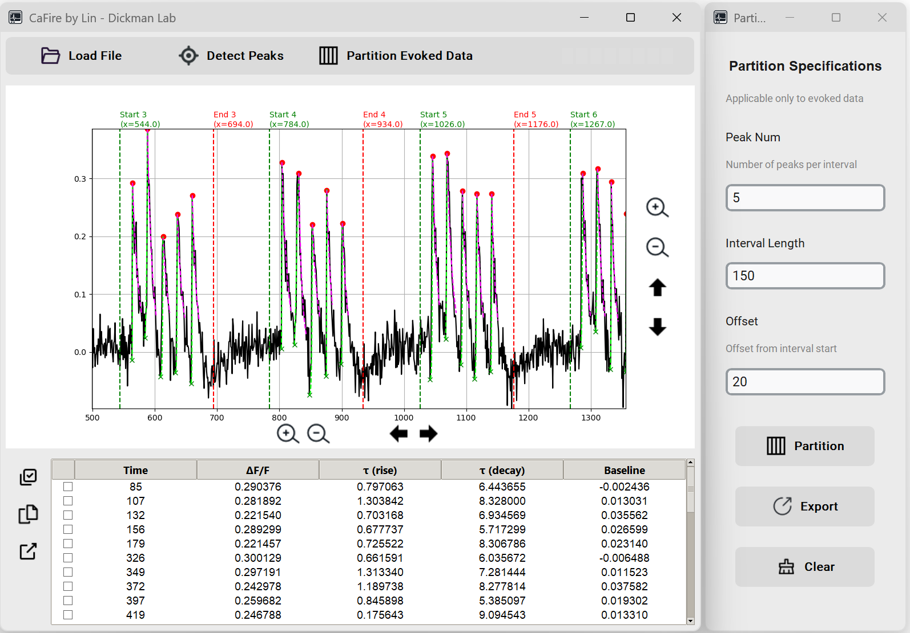

# CaFire

CaFire is a Python-based software designed for calcium imaging data analysis. It provides an intuitive graphical user interface that enables automatic peak detection and analysis for both evoked and miniature events, making data interpretation more efficient and accurate.



## Features

- **Data Loading and Processing**
  - Support for Excel file formats
  - Supports baseline calculation using customizable window size and percentile settings
  - Automatic ΔF/F calculation
  - Automatically perform ΔR/R conversion after loading the RFP channel
  
- **Peak Detection**
  - Automated mini detection with adjustable parameters
  - Interactive peak marking and deletion

- **Rise and Decay Time Analysis**
  - Automated calculation of rise and decay times
  - Exponential curve fitting for both rise and decay phases

- **Evoked Response Analysis**
  - Partition tool for evoked response analysis
  - Customizable interval settings
  - Export capabilities for analyzed segments



## Installation

1. Download the latest release from the [releases page](https://github.com/linj7/CaFire/releases)
2. Run the executable file (no installation required)

Or run from source code:

```bash
# Clone the repository
git clone https://github.com/linj7/CaFire.git

# Install required packages
pip install -r requirements.txt

# Run the application
python main.py
```

Or build into an exe file and execute:

```bash
pyinstaller main.py --onefile --noconsole --name="CaFire" --icon=assets/ecg_icon.ico --add-data "assets;assets"
```

## Requirements

- Python==3.10.11
- CairoSVG==2.7.1
- customtkinter==5.2.2
- matplotlib==3.7.2
- numpy==1.24.3
- openpyxl==3.0.9
- pandas==2.0.3
- Pillow==11.1.0
- scipy==1.10.1

## Usage Guide

### Loading Data

1. Click the "Load File" button
2. Select your Excel file
3. Specify the sheet name and column names for time and fluorescence data
4. Set the baseline calculation parameters — window size and percentile
5. Choose whether to analyze evoked or miniature events
6. Choose whether to convert to ΔF/F format

### Peak Detection

1. Click the "Detect Peaks" button
2. Set detection parameters:
   - Peak threshold (required)
   - Minimum distance between peaks
   - Peak width
3. Review detected peaks
4. Enter the peak click window size in the upper-right input box
5. Manually add or remove peaks by clicking on the plot
6. Review all the fitted curves
7. For peaks with poor decay fitting, right-click "Decay Time" in the table and click recalculate

### Evoked Response Analysis
This feature is only applicable to evoked data.
1. Click "Partition Evoked Data"
2. Set partition parameters:
   - Number of peaks per interval
   - Interval size
   - Offset
3. Review partitioned segments
4. Export results using the export button

## Contributing

Contributions are welcome! Please feel free to submit a Pull Request.

## License

This project is licensed under the MIT License - see the [LICENSE](LICENSE) file for details.

## Contact

- Author: Junhao Lin
- Lab: Dickman Lab
- Email: linjunha@usc.edu
