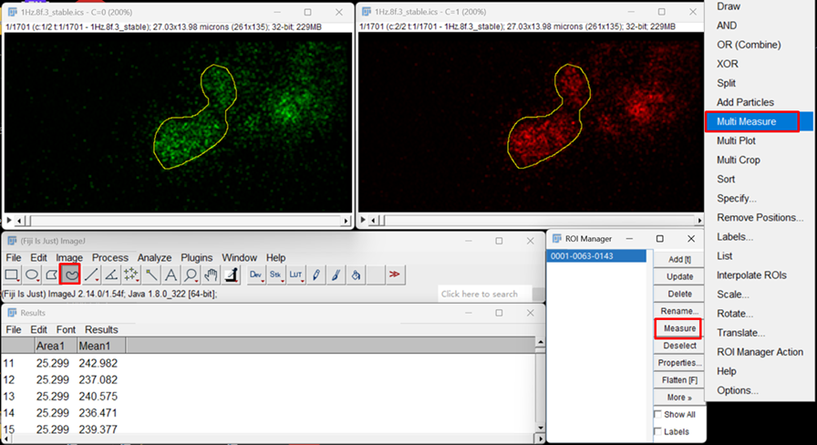
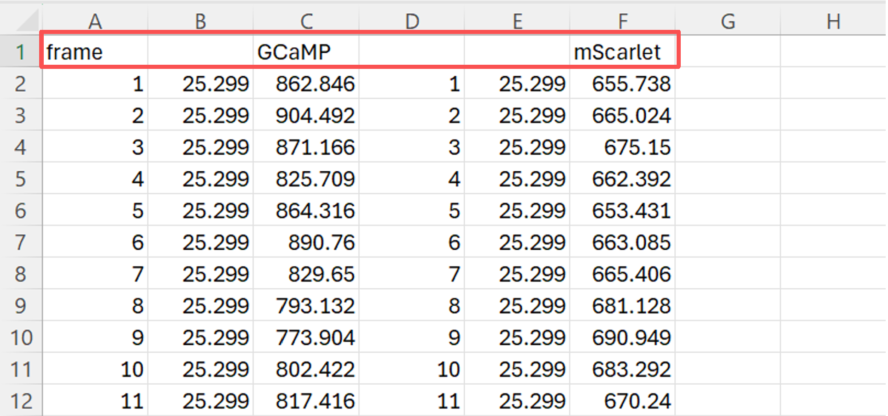
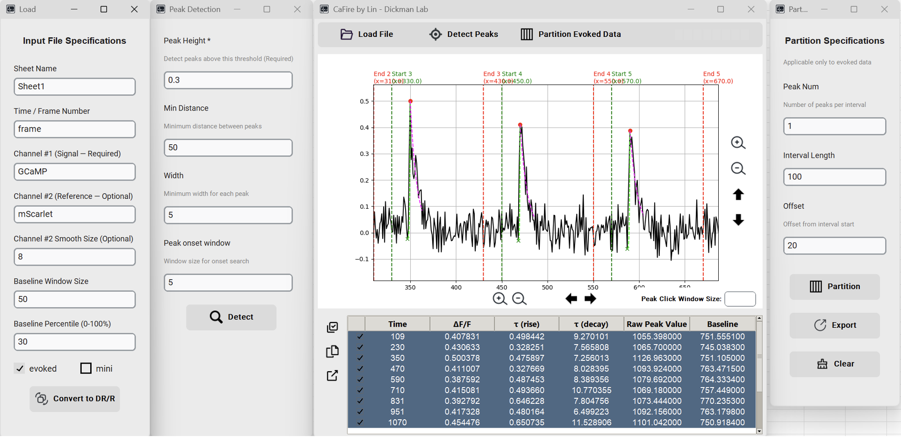

# CaFire

CaFire is a Python-based software designed for calcium imaging data analysis. It provides an intuitive graphical user interface that enables automatic peak detection and analysis for both evoked and miniature events, making data interpretation more efficient and accurate.


## Features

- **Data Loading and Processing**
  - Support for Excel file formats
  - Supports baseline calculation using customizable window size and percentile settings
  - Automatic ΔF/F calculation
  - Automatically perform ΔR/R conversion after loading the RFP channel
  
- **Peak Detection**
  - Automated mini detection with adjustable parameters
  - Interactive peak marking and deletion

- **Rise and Decay Time Analysis**
  - Automated calculation of rise and decay times
  - Exponential curve fitting for both rise and decay phases

- **Evoked Response Analysis**
  - Partition tool for evoked response analysis
  - Customizable interval settings
  - Export capabilities for analyzed segments

## Installation

1. Download the latest release from the [releases page](https://github.com/linj7/CaFire/releases)
2. Run the executable file (no installation required)

Or run from source code:

```bash
# Clone the repository
git clone https://github.com/linj7/CaFire.git

# Install required packages
pip install -r requirements.txt

# Run the application
python main.py
```

Or build into an exe file and execute:

```bash
pyinstaller main.py --onefile --noconsole --name="CaFire" --icon=assets/ecg_icon.ico --add-data "assets;assets"
```

## Requirements

- Python==3.10.11
- CairoSVG==2.7.1
- customtkinter==5.2.2
- matplotlib==3.7.2
- numpy==1.24.3
- openpyxl==3.0.9
- pandas==2.0.3
- Pillow==11.1.0
- scipy==1.10.1

## Processing Pipeline for ROI Extraction and CaFire Analysis

1. Import the processed images into Fiji/ImageJ. Using the “**Freehand Selection Tool”**, draw ROIs around the structures of interest. For each ROI, perform **“Multi Measure”** separately on the GCaMP and mScarlet channels.

   

2.  Export the resulting measurements to Excel and ensure that the **first row contains the appropriate column headers** (example excel file provided).

   

3. Open CaFire and enter the required acquisition parameters. Import the Excel file that contains the ROI time-series data. 

   a. For **single-channel imaging**, load the GCaMP signal into **Channel 1**; For **dual-channel imaging**, also load the mScarlet signal into **Channel 2**.

   b. For evoked recordings, check the **“Evoked”** option; for spontaneous recordings (miniature events), select **“Mini.”**

   c. In single-channel mode, users may choose to load **raw fluorescence data** or allow CaFire to compute **ΔF/F** automatically. In dual-channel mode, CaFire will automatically compute and plot **ΔR/R** traces.

4. Use the **Peak Detection** tool to identify events automatically. Data can be further inspected by zooming into individual regions using the **Zoom In** button; peaks can be manually **selected** (left-click) or **unselected** (right-click) for correction. 
5. After peak detection is finalized, use the **Partition** function to automatically divide the trace into predefined segments.
6. Finally, export all processed results to a new Excel file for downstream analysis.

​	

## Contributing

Contributions are welcome! Please feel free to submit a Pull Request.

## License

This project is licensed under the MIT License - see the [LICENSE](LICENSE) file for details.

## Contact

- Author: Junhao Lin
- Lab: Dickman Lab
- Email: linjunha@usc.edu
